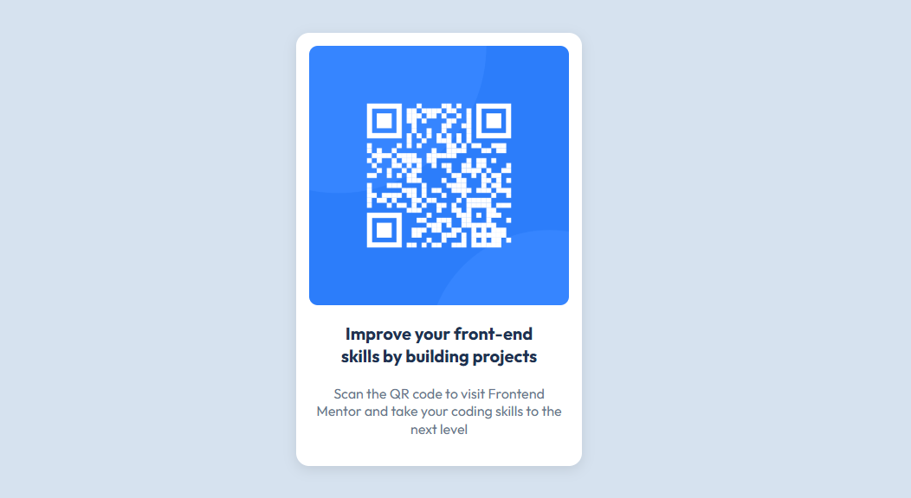

# QR Code Component Challenge - Frontend Mentor 🚀

Este é o meu projeto de componente QR Code, desenvolvido como parte de um desafio no [Frontend Mentor](https://www.frontendmentor.io). O objetivo é criar uma solução que corresponda ao design fornecido, aplicando boas práticas de HTML e CSS para criar um componente responsivo e visualmente atrativo.


---

## 🛠 Tecnologias Utilizadas

- **HTML5**: Para estruturar o conteúdo de forma semântica e acessível.
- **CSS3**: Para estilizar e criar um design responsivo.
- **Google Fonts**: Fonte personalizada [Outfit](https://fonts.google.com/specimen/Outfit) para uma melhor apresentação visual.
- **Flexbox**: Para alinhamento e organização de elementos de forma eficiente.

---

## 📋 Funcionalidades

- ✅ Componente centralizado vertical e horizontalmente na página.
- ✅ Design responsivo que se ajusta a diferentes tamanhos de tela.
- ✅ Uso de variáveis CSS para facilitar personalizações futuras.
- ✅ Acessibilidade: Uso de textos alternativos descritivos para imagens.

---

## 🖼 Prévia do Design

Confira como o componente se parece ao ser renderizado:



---

## 🚀 Como Rodar o Projeto Localmente

1. Clone este repositório:
   ```bash
   git clone https://github.com/FabioGoulart17/Frontend_Mentor

2. Acesse o diretório do projeto:
   - FRONTEND_MENTOR

3. Abra o arquivo "index.html" no navegador de sua preferência.
   

🌟 Aprendizados
Neste desafio, aprendi:

- Como usar variáveis CSS para criar um design consistente.
- A importância do uso de fontes personalizadas para um layout profissional.
- Como centralizar elementos vertical e horizontalmente usando Flexbox.
- Boas práticas de estruturação semântica em HTML.


📂 Estrutura do Projeto

/FRONTEND_MENTOR
├── .vscode/               # Configurações específicas do VS Code
├── images/                # Pasta contendo as imagens do projeto
├── .gitignore             # Arquivo para ignorar arquivos/diretórios no Git
├── index.html             # Arquivo HTML principal do projeto
├── README.md              # Documentação do projeto
├── reset.css              # Arquivo de reset CSS para consistência entre navegadores
├── style-guide.md         # Guia de estilo ou diretrizes para o projeto
└── style.css              # Arquivo CSS principal do projeto


📬 Contato

Gostou do projeto? Entre em contato comigo:

E-mail: [fabioggoulart17@gmail.com](mailto:fabioggoulart17@gmail.com)

GitHub: [FabioGoulart17](https://github.com/FabioGoulart17)


⭐ Contribua

Se você quiser sugerir melhorias ou contribuir para este projeto, fique à vontade para abrir uma issue ou enviar um pull request.

🔗 Desafio no Frontend Mentor

Este projeto foi baseado no desafio QR Code Component.

Feito com ❤️ por Fábio Goulart.


